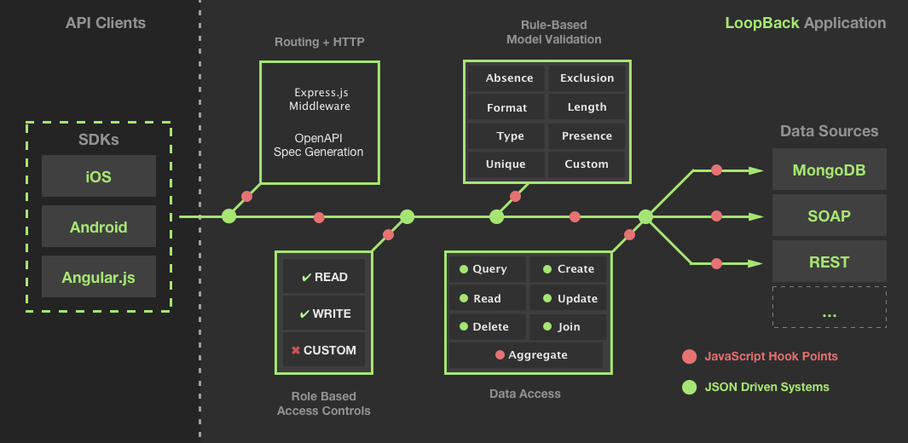

# Acme Freight ERP Quick Links
- [Go to the Acme Freight journey website](http://developer.ibm.com/code/journey/unlock-enterprise-data-using-apis?cm_mmc=github-code-_-native-_-acme-_-journey&cm_mmca1=000019RT&cm_mmca2=10004796)
- [View the main Acme Freight repository](https://github.com/ibm/acme-freight)
- [Skip to the Acme Freight ERP LoopBack tutorial](https://github.com/ibm/acme-freight/APIC-ERP-README.md) 
- [Read the blog post about implementing LoopBack for Acme Freight's ERP system](https://developer.ibm.com/code/2017/05/04/unlock-enterprise-data-with-loopback?cm_mmc=github-code-_-native-_-acme-_-related-content&cm_mmca1=000019RT&cm_mmca2=10004796)

# The Acme Freight Journey

Acme Freight Shipping is a fictional shipping and logistics company using the [Logistics Wizard](https://github.com/ibm-bluemix/logistics-wizard) application framework to reimagine supply chain optimization systems for the 21st century.

Acme Freight uses an application, called [Logistic Wizard](https://github.com/ibm-bluemix/logistics-wizard) to manage some of its assets. The application is composed of several microservices, including three Cloud Foundry applications and multiple OpenWhisk actions.

Acme Freight uses LoopBack, an open source Node.js framework, built for quickly creating and exposing APIs for new and existing applications and data. LoopBack enables Acme Freight to create an application that integrates with their existing ERP system, and API Connect allows them to expose data via a managed API.

*For more on the Acme Freight journey and the technologies behind it, [visit the Acme Freight journey website](http://developer.ibm.com/code/journey/unlock-enterprise-data-using-apis?cm_mmc=github-code-_-native-_-acme-_-journey&cm_mmca1=000019RT&cm_mmca2=10004796).*

## Acme Freight Tutorials

To start learning more about Acme Freight and the technology behind it, jump to one of the tutorials below.

### Deploy Acme Freight
* [Deploy your own Acme Freight with IBM DevOps Toolchain](https://github.com/ibm/acme-freight/blob/master/TOOLCHAIN-README.md) 

### Rapidly Create APIs with the Node API Framework, LoopBack 
* [Use LoopBack and API Connect to rapidly expose ERP data with APIs](https://github.com/ibm/acme-freight/blob/master/APIC-ERP-README.md) 

### Create APIs for OpenWhisk actions in just a few clicks
* [Create an API for your OpenWhisk actions on Bluemix](https://github.com/ibm/acme-freight/blob/master/OW-NAPI-README.md) 

## Acme Freight Architecture

The following projects are leveraged in the overall Acme Freight solution:

* [acme-freight-erp](https://github.com/ibm/acme-freight-erp) - defines the API used by Acme Freight to access data from an ERP system. It also provides a default implementation to be used as a simulator. The simulator is a Node.js application connected to a PostgreSQL database. Through its API, it manages users (supply chain managers and retail store managers), distribution centers, retail stores and shipments.

* [acme-freight-webui](https://github.com/ibm/acme-freight-webui) - provides a dashboard to view ongoing shipments and alerts. There is no log-in or user credentials per se to use the deployed applications. Instead a unique demo ID is assigned to any new user trying the application. Behind each demo ID, Acme Freight creates an isolated environment with a default set of business users, distribution centers, retail stores, shipments. Refer to the [walkthrough](WALKTHROUGH.md) to get a tour of the capabilities.

* [acme-freight-recommendation](https://github.com/ibm/acme-freight-recommendation) - makes shipment recommendations based on weather conditions. It is a set of Bluemix OpenWhisk to retrieve current weather conditions and given a weather event to generate new shipment recommendations. These recommendations could then be turned into real orders.

* [acme-freight-controller](https://github.com/ibm/acme-freight-controller) - acts as the main controller for interaction between the services. It receives requests from the user interface and routes them to the ERP or the weather recommendation module.

*Acme Freight is forked and extended from the IBM Bluemix project, Logistics Wizard. Visit the Logistics Wizard project [wiki](https://github.com/IBM-Bluemix/logistics-wizard/wiki) for a detailed breakdown of the original Logicistics Wizard architecture and deployment strategy.*

## Overview

With the Acme Freight app, we focus on the planning and delivery of products from distribution centers to retail locations. Acme Freight's ERP service defines a subset of a full ERP system data model. 

Acme Freight uses LoopBack to expose existing ERP data via an API and API Connect to secure and manage the API. 

### API Definition

The API and data models are defined in [this Swagger 2.0 file](spec.yaml). You can view this file in the [Swagger Editor](http://editor.swagger.io/#/?import=https://raw.githubusercontent.com/ibm/acme-freight-erp/master/spec.yaml
).

The API allows to:
* log in and get access tokens;
* get the list of Products, Distribution Centers, Retailers;
* create, retrieve, update, delete Shipments.

The API defines the following roles:
* supply chain manager - can view all data and manage Shipments
* retail store manager - can view all data except Inventory and Suppliers
